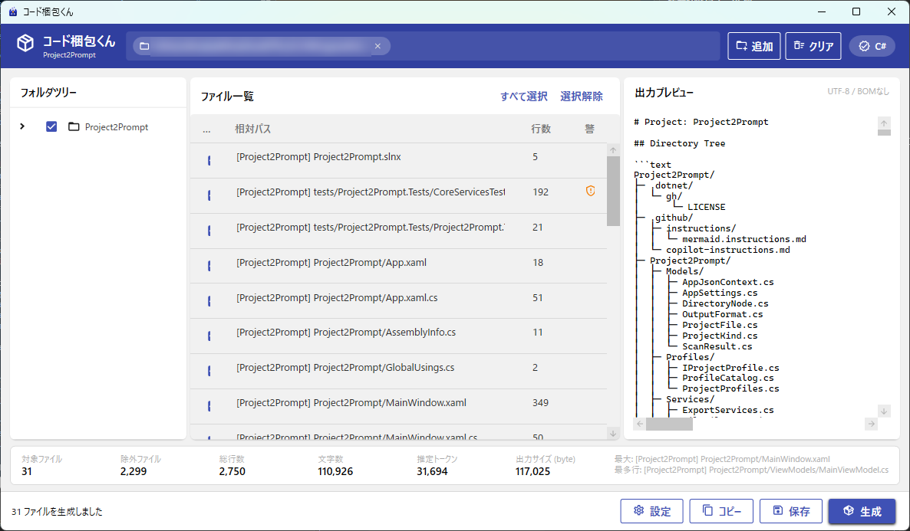

# コード梱包くん（Project2Prompt）

プロジェクトのフォルダにあるコードを、1つのテキストにまとめるWindowsアプリです。
ブラウザのAIチャットにコードをまとめて渡したいときに使います。



## できること

- フォルダを追加して「生成」を押すと、フォルダの構成とコードを1つのテキストにまとめる
- プロジェクトの種類（C# / VB.NET / Python）を見分けて、必要なファイルだけを選ぶ
- `bin`、`obj`、`.git`、`.venv`、自動生成されたファイルなどは、最初から除外する
- ツリーと一覧のチェックで、渡すファイルを絞り込める
- 対象ファイル数、総行数、文字数、推定トークン数、出力サイズを表示する
- APIキーやパスワードらしい記述を見つけて、伏せ字にする／ファイルごと除外する／そのまま含める、から選べる
- コメントの除去、行末の空白の除去、空行の整理、`#region` の除去、行番号の付加
- Markdown またはテキストで出力し、クリップボードへのコピーとファイル保存ができる
- UTF-8 で読めないファイルは、Shift-JIS として読み直す

## ダウンロード

[Releases](../../releases) から zip をダウンロードして展開し、`Project2Prompt.exe` を実行してください。
.NET のインストールは不要です（Windows 10 / 11、64bit）。

## 使い方

1. 「追加」を押すか、ウィンドウにフォルダをドラッグ＆ドロップする
2. 必要に応じて、ツリーや一覧のチェックで対象のファイルを絞る
3. 「生成」を押す
4. 「コピー」でクリップボードにコピーして、AIチャットに貼り付ける（「保存」でファイルにもできます）

## 注意

- 秘密情報の検出は、よくある書き方を見つけるためのもので、完全ではありません。
  貼り付ける前に、出力プレビューを自分の目でも確かめてください。
- 推定トークン数は、文字数から割り出した目安です。実際の数は、使うAIによって変わります。

## ビルド

.NET 10 SDK と Windows が必要です。

```powershell
dotnet build Project2Prompt.slnx
dotnet test Project2Prompt.slnx
dotnet publish Project2Prompt/Project2Prompt.csproj -c Release -o publish
```

## ライセンス

[MIT License](LICENSE)

利用しているオープンソースソフトウェアについては、[THIRD-PARTY-NOTICES.md](THIRD-PARTY-NOTICES.md) を参照してください。
